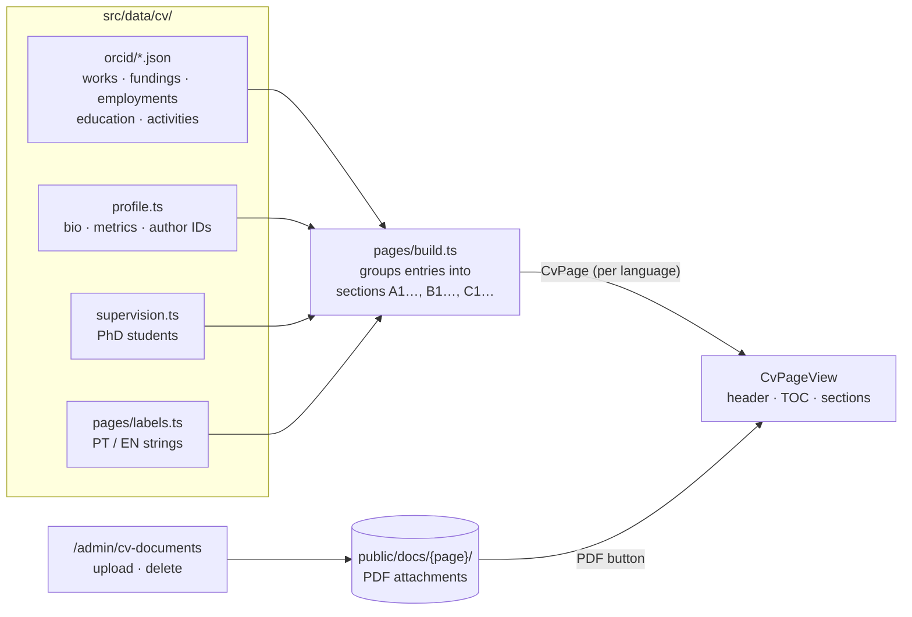

# Nelson Ricardo Rodrigues — Academic Website

Personal website of **Nelson Ricardo Rodrigues**, Principal Investigator at
[DTx — Digital Transformation CoLAB](https://www.dtx-colab.pt/), working on
multi-agent systems, cyber-physical production systems and industrial AI.

[](https://nextjs.org/)
[](https://www.typescriptlang.org/)
[](https://tailwindcss.com/)
[](https://www.prisma.io/)
[](https://orcid.org/0000-0001-7986-3754)

The site has two parts:

| | What it is | Where the content lives |
|---|---|---|
| **Main site** | Home, academic path, positions, publications, patents, projects, students | SQLite database, edited from the `/admin` backoffice |
| **CV Academic** | A bilingual (PT/EN) long-form academic CV organised by merit area | Versioned JSON/TypeScript under `src/data/cv/`, PDFs under `public/docs/` |

---

## CV Academic

A self-contained, bilingual CV under `/cv-academic`. Its structure follows the
Portuguese academic convention of splitting a CV by merit area, and it borrows
the information architecture of
[carlamorais.pt](https://www.carlamorais.pt/en/scientific-merits/): one flat
menu, a numbered section hierarchy (A1 → A1.1 → numbered lists) and a sticky
table of contents that tracks your scroll position.

### Pages

Portuguese lives at the root of the section and English under `/en/`. The
language switcher always lands on the equivalent page, never on the home page.

| Page | Portuguese | English |
|---|---|---|
| Home | `/cv-academic` | `/cv-academic/en` |
| Summary | `/cv-academic/resumo-do-cvrricvlvm-vitae` | `/cv-academic/en/cvrricvlvm-vitae-short-summary` |
| Scientific merit | `/cv-academic/vertente-merito-cientifico` | `/cv-academic/en/scientific-merits` |
| Pedagogical merit | `/cv-academic/vertente-merito-pedagogico` | `/cv-academic/en/pedagogical-merits` |
| Other activities | `/cv-academic/outras-atividades-relevantes` | `/cv-academic/en/further-relevant-activities` |
| Contacts | `/cv-academic/contactos` | `/cv-academic/en/contacts` |

All twelve routes are statically generated at build time.

### How a page is built



One data set feeds both languages: publications are stored once and only
section titles and labels are translated. Update a JSON file and both versions
of the page change together.

### What each entry can show

Every CV line is a `CvEntry` (`src/data/cv/types.ts`):

- **title**, linked to its canonical page (usually the DOI)
- **year**, **authors** and **venue**
- a **PDF** button, when a file is attached
- **link chips**: Publisher, Repository, Proceedings, Preprint, Dataset,
  CORDIS, Archived, and a green **Free access** chip when a legitimate open copy
  exists elsewhere

The home page links the four author profiles: ORCID, Scopus, ResearcherID
(Web of Science) and Google Scholar.

### About the PDFs

The PDFs in `public/docs/scientific/` were collected from open sources only
(publisher open access and institutional repositories). Each one was checked
against its title and author line. A copy is hosted only when its licence
allows it: a Creative Commons licence, or an accepted manuscript from an open
repository. When the only open copy is the publisher's version without an open
licence, the entry gets a **Free access** link instead of a hosted file.

---

## Updating the CV

**Add a publication.** Append it to `src/data/cv/orcid/works.json`. The
`type` field decides which section it lands in: `journal-article`,
`conference-paper`, `book-chapter`, `book`, `preprint`, `data-set`, `software`,
or `lecture-speech`, which goes to the teaching section.

```json
{
  "title": "An agent-based approach for the dynamic and decentralized service reconfiguration in collaborative production scenarios",
  "year": "2017",
  "type": "conference-paper",
  "venue": "Lecture Notes in Computer Science",
  "url": "https://doi.org/10.1007/978-3-319-64635-0_11",
  "authors": ["Nelson Rodrigues", "Paulo Leitão", "Eugénio Oliveira"],
  "file": "2017-agent-based-approach-dynamic-decentralized-service.pdf",
  "links": [
    { "kind": "publisher", "url": "https://link.springer.com/chapter/10.1007/978-3-319-64635-0_11" },
    { "kind": "repository", "url": "http://hdl.handle.net/10198/16417" }
  ]
}
```

**Attach a PDF.** Upload it at `/admin/cv-documents`, or drop it into the
page's folder under `public/docs/`, then set `"file"` on the entry. The admin
page shows the exact value to paste. Files are shared by both languages.

| Folder | Page |
|---|---|
| `public/docs/summary/` | Summary |
| `public/docs/scientific/` | Scientific merit |
| `public/docs/pedagogical/` | Pedagogical merit |
| `public/docs/other/` | Other activities |
| `public/docs/contacts/` | Contacts |

**Hide a work** without deleting it, for example one that Scopus attributed to
a namesake: add `"hidden": "<reason>"` to it. Two works are hidden this way
today.

**Add a PhD student.** Edit `src/data/cv/supervision.ts`. The counts shown in
the CV are derived from that list.

**Rename a URL.** All slugs and menu labels live in one place:
`src/data/cv/routes.ts`.

---

## Getting started

```bash
npm install
cp .env.example .env          # then set AUTH_SECRET and ADMIN_PASSWORD_HASH
node -e "console.log(require('bcryptjs').hashSync('your-password', 10))"
npx prisma migrate dev
npm run db:seed
npm run dev
```

| URL | |
|---|---|
| http://localhost:3000 | Main site |
| http://localhost:3000/cv-academic | CV Academic (PT) — `/cv-academic/en` for English |
| http://localhost:3000/admin | Backoffice — sign in with `ADMIN_USERNAME` and the password you hashed into `ADMIN_PASSWORD_HASH` |

### Scripts

| Command | What it does |
|---|---|
| `npm run dev` | Development server |
| `npm run build` | Production build (type-checks and prerenders the CV) |
| `npm run start` | Serve the production build |
| `npm run lint` | ESLint |
| `npm run db:migrate` | Apply Prisma migrations |
| `npm run db:seed` | Seed the database |
| `npm run db:reset` | Drop and recreate the database |
| `npm run db:studio` | Browse the database in Prisma Studio |

---

## Project structure

```
src/
├── app/
│   ├── (public)/                 # public pages, share Navbar + Footer
│   │   ├── cv-academic/          # bilingual CV: PT at the root, EN under en/
│   │   │   ├── [slug]/page.tsx
│   │   │   └── en/[slug]/page.tsx
│   │   ├── publications/ projects/ students/ …
│   │   └── page.tsx              # home
│   └── admin/                    # backoffice (NextAuth-protected)
│       └── cv-documents/         # PDF upload for the CV
├── components/
│   ├── public/cv/                # CvHome, CvHeader, CvToc, CvSections, CvEntryList, CvProfileLinks
│   └── admin/
├── data/cv/                      # CV content (see "How a page is built")
└── lib/                          # prisma, auth, server actions, document helpers
public/
└── docs/<page>/                  # CV attachments
```

---

## Deployment notes

- Uploads from `/admin/cv-documents` are written to `public/docs/` on disk, and
  the database is SQLite. Both need a **persistent filesystem**: a VPS,
  container volume or similar. On serverless platforms, commit PDFs to the
  repository instead, and move the database to a hosted one.
- The CV itself is static. Changes to `src/data/cv/` go live after a rebuild.

## Credits

Layout inspired by [Paulo Leitão's academic website](https://pages.ipb.pt/~pleitao/).
CV information architecture inspired by
[Carla Morais's CV](https://www.carlamorais.pt/en/scientific-merits/). The
structure is borrowed; no content from that site is reproduced here.
